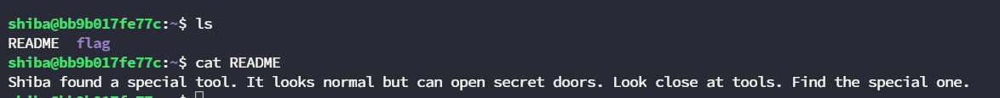

# [MISC] LINUX101

### 10th March 2024

**Author**: `kahang`

**Difficulty**: `Easy`

**Flag**: `FIA{n0w_y0u_h4v3_kn0wn_7h3_b451c_l1nux}`

### Description

> Help shiba uncover the hidden text.
> 

### Objective

> Privilege Escalation to read files and grep flag with regex.
> 

### Skills Required

- Basic Linux Command & File Permission

---

# Solution

### Enumeration

- Finding clude on the system.

- We can see that all the files within the flag belong to root and there is no read permission for others.

- Finding which tool have SUID permission. We can see that there is a command name `mawk` .

- From here we can search on [GTFOBins](https://www.notion.so/MISC-LINUX101-b030798fa70c4b188f56d4fde85e8d33?pvs=21) to see if this command can be abused and leveraged to read files.

- Then just read all with a wild card `*` and grep for exact flag format.

`mawk // * | grep -E "FIA{.*}”`

