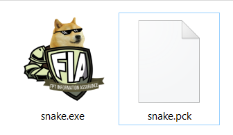
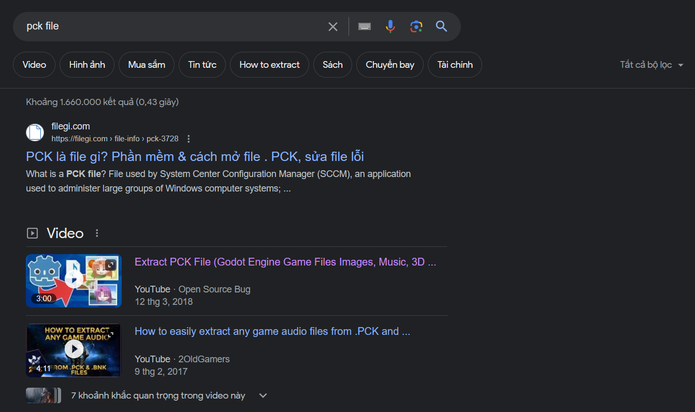
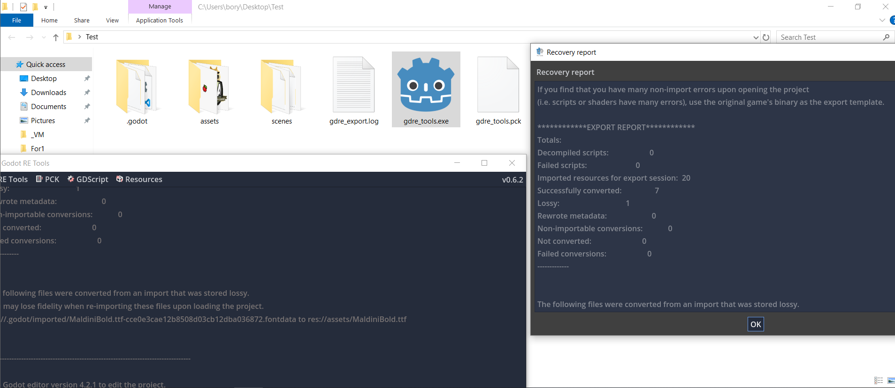
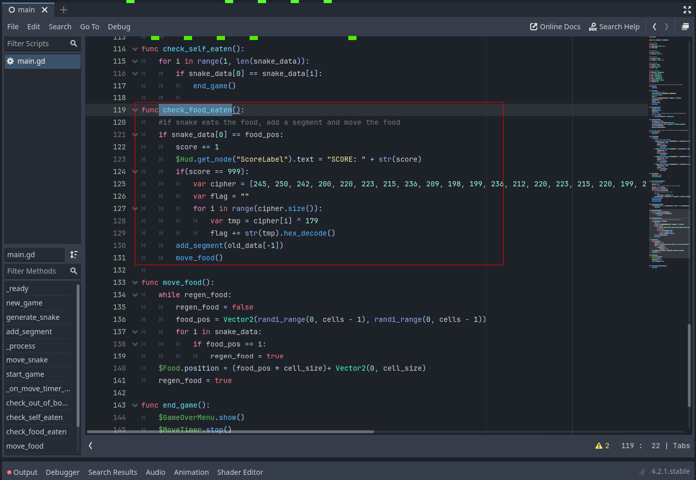
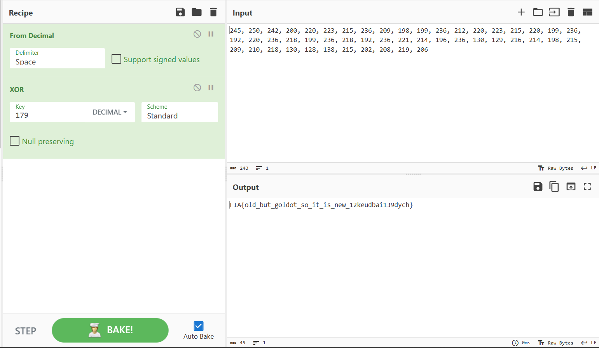

# Baby Snake

## Description

Tui thích trò chơi con rắn, nên tui ra đề con rắn hoài được không ? :D

[Release](https://github.com/FIA-FPT-Information-Assurance-Club/2024-Technical-Entrance-Test/tree/main/reverse/Baby-Snake/dist)

[Source](https://github.com/FIA-FPT-Information-Assurance-Club/2024-Technical-Entrance-Test/tree/main/reverse/Baby-Snake/source/snake_tutorial-main)

### Objective

- Biết cách dịch ngược 1 game được tạo ra bằng Godot Engine

### Difficulty

`easy`

### Flag

`FIA{old_but_goldot_so_it_is_new_12keudbai139dych}`

## Challenge

Đề cung cấp cho ta 1 file exe và 1 file pck.

Sau khi chơi game thử thì đây là một con game rắn Snake Xenzia bình thường.

Điều đầu tiên ta cần phải xác định khi dịch ngược một game đó là phải tìm được nó được tạo nên bởi engine nào. Có rất nhiều cách để xác định điều này, ở bài này ta có thể dùng strings, xem properties hoặc research trên google extension `pck` là loại file gì từ đó xác định được đây là game được tạo bởi `Godot engine`.

Sau đó ta research cách reverse một game Godot như thế nào thì có tool [gdsdecomp](https://github.com/bruvzg/gdsdecomp).

Sử dụng `gdsdecomp` import file pck vào ta sẽ nhận được tất cả resource và code tạo nên game này.

Trong cấu trúc file của godot có một file tên `project.godot` chứa thông tin tham chiếu đến các resource và code của godot. Ta tải [IDE của godot](https://godotengine.org/download/windows/) về và import file này vào.

Sau khi nhìn thấy toàn bộ code của hàm main, tìm function ` check_food_eaten` .

Ở đây đoạn code check nếu điểm đạt 999 sẽ giải mã flag và in ra màn hình. Ta chỉ cần giải mã bằng cách y chang là ra flag.

## Solver

