# Couple Shiba

## Description

Sau buổi đi chơi đá tuyết, cặp đôi White Shiba và Yellow Shiba thì đem con bỏ nhà đi hẹn hò ôn lại kỷ niệm xưa. Cả hai chơi một trò chơi thú dị. Cùng tìm hiểu xem cả hai đã chơi trò gì nhé :D

**Password file zip:** infected

**Lưu ý:** File này không chứa mã độc, tuy nhiên Shiba không khuyến khích chơi trên máy thật. Bạn nào có máy ảo Windows thì nên xài, bạn nào không có thì chơi trên máy thật cũng được, tuy nhiên. **Hãy cẩn thận** 😉

[Release](https://github.com/FIA-FPT-Information-Assurance-Club/2024-Technical-Entrance-Test/tree/main/reverse/Couple-Shiba/dist)

[Source](https://github.com/FIA-FPT-Information-Assurance-Club/2024-Technical-Entrance-Test/blob/main/reverse/Couple-Shiba/source/Chall/Chall/Chall.cpp)

### Objective

- Ôn tập cách phát hiện, sử dụng, bypass một số anti debugger cơ bản.
- Thuật toán RC4.
- Có thêm góc nhìn về việc code chạy ngoài hàm main.

### Difficulty

`hard`

### Flag

`FIA{White_Shiba_4nd_Yellow_Shiba_1s_4_sup3r_cut13_c0upl3_<3}`

## Challenge

Khi chạy thử file, thì đây là một trò chơi của đôi vợ chồng Shiba, một trò chơi đoán số, nếu ta đoán được đúng hết thì chương trình sẽ encrypt file flag cho chúng ta.

### Static analysis
Khi load vào IDA, nhìn tổng quan các `strings` thì toàn là fake flag và rickroll. Tuy nhiên xem trong `segments` rdata thì nhận thấy chương trình này có [`TLSCallBack`](https://hex-rays.com/blog/tls-callbacks/), một địa điểm thú vị thường được dùng để implement các kỹ thuật anti-reverse.

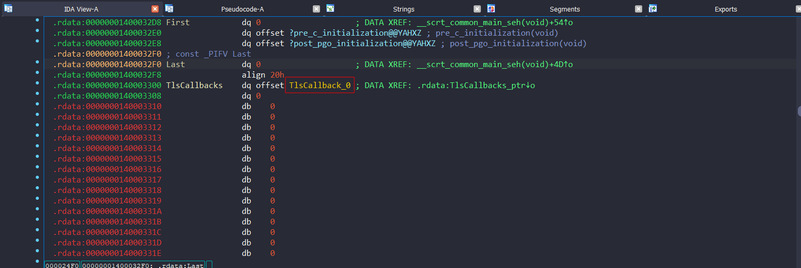

Quay lại hàm `main`, đầu tiên là hàm `IsDebuggerPresent` có thể bypass dễ dàng bằng cách đặt breakpoint rồi set IP vòng qua nó.

Kế đến là vòng for thực hiện trò chơi, từng số nhập vào sẽ được lưu ở mảng `v36`, bên cạnh đó hàm `rand` cũng được gọi và lưu từng số ở mảng `v38`

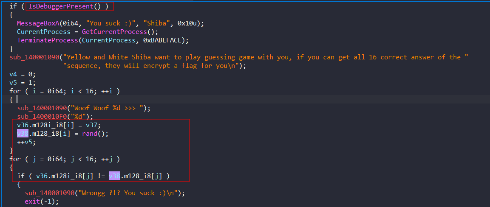

Sau đó đem so sánh từng số của 2 mảng nếu đúng hết thì tiếp tục, nếu sai thì kết thúc chương trình. Sau đó mảng `v36` được xor với `dword_1400056D0` và lưu vào `v38`.

Kế đến chương trình thực hiện đọc file và thực hiện mã hóa nó dựa trên `v38` theo một thuật toán phức tạp nào đó mà ta có thể dễ dàng tìm ra được bằng cách hỏi chatGPT.

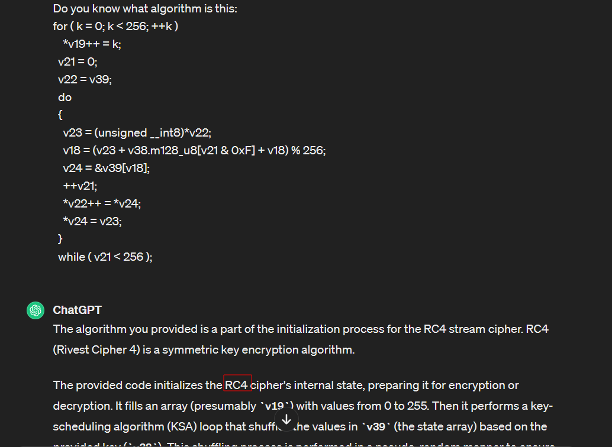

Vậy ở đây chương trình sử dụng thuật toán [`RC4`](https://www.geeksforgeeks.org/implementation-of-rc4-algorithm/) với key là `v38` để mã hóa file của chúng ta. Sau đó thực hiện ghi file.

### Dynamic analysis

**Lưu ý: Tên các biến trong bài viết có thể thay đổi khi chạy trên máy của các bạn nên hãy cẩn thận mapping nó với đoạn code mà tôi nói tới để tránh bị nhầm lẫn.**

Theo như phân tích static ở trên ta sẽ cần bypass `IsDebuggerPresent` nên sẽ đặt breakpoint ngay trước nó rồi bắt đầu chạy.

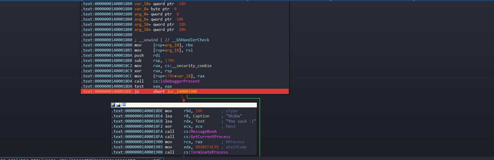

Tuy nhiên, máy của chúng ta liền bị shutdown !?!

OK, trong hàm main khi phân tích không thấy có dấu hiệu shutdown máy tính nào vậy thì nó nằm ở đâu ?

Tìm kiếm lại trong segment rdata ta phát hiện bên cạnh `TLSCallBack` còn một hàm lạ nữa là `sub_140001000`.

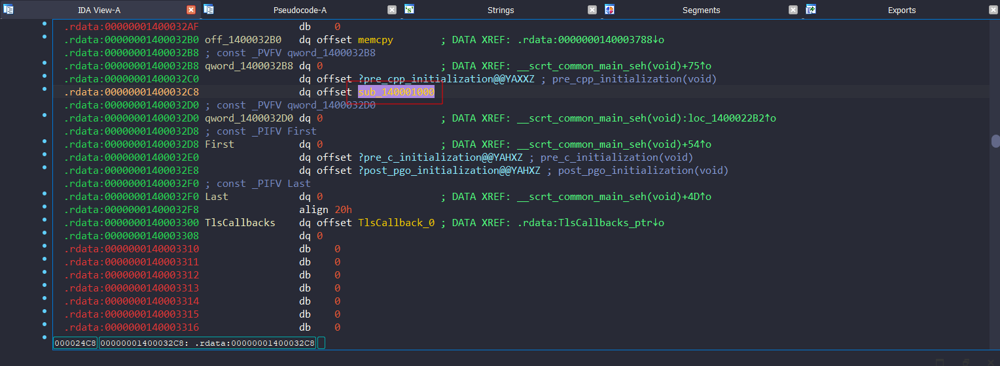

Từ hàm `sub_140001000` sẽ dẫn ta đến hàm `sub_140001310` trông rất khả nghi vì nó có thực hiện check anti debug bằng `NtGlobalFlag` và gọi hàm `system`. Bên cạnh đó ta còn thấy có hàm `srand` với seed 0x1709. Tiến hành đặt breakpoint ngay đầu hàm này và ngay chỗ check anti debug.

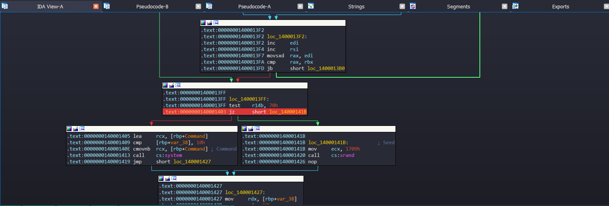

Chạy lại chương trình và bingo !!! Chúng ta không bị shutdown máy nữa mà chương trình dừng ngay đúng breakpoint đang check anti debug. Ta có thể thấy ở `rbp+Command` có hẳn nguyên câu lệnh shutdown máy tính.

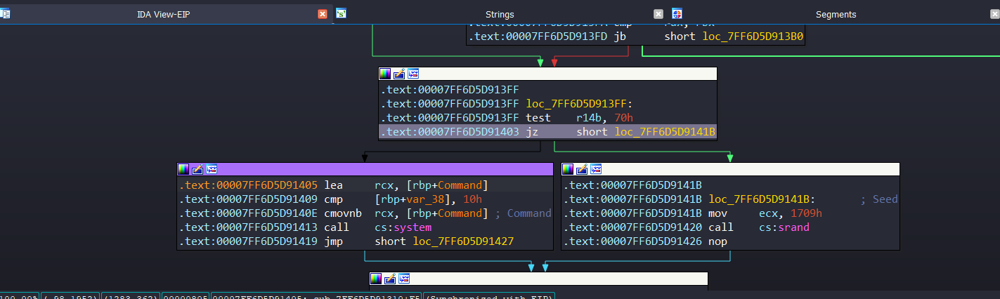

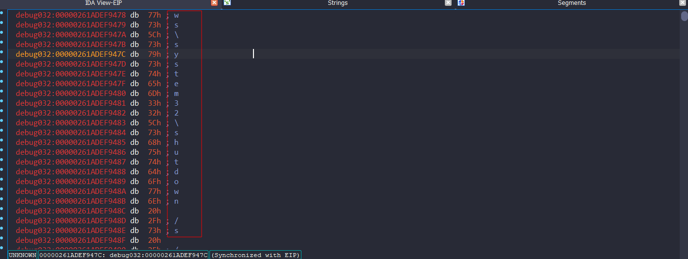

Set IP chạy sang các instruction gọi hàm `srand` rồi chạy tiếp chương trình. Ta đã vào được hàm main. Từ đây ta sẽ debug để lấy ra từng giá trị `rand` để làm key (lưu ý lúc này đã có `srand` với seed là 0x1709).

Dãy số ngẫu nhiên có được như sau: 95 96 241 182 108 235 121 225 226 225 210 100 236 78 39 210.

Tuy nhiên tại đây vẫn còn một cái bẫy nữa của người ra đề. Mảng số ngẫu nhiên sau khi nhập được xor với `dword_7FF6D5D956D0` (là `dword_1400056D0` đã đổi tên trong quá trình runtime), mà biến này lại được xuất hiện ở `TLSCallBack`.

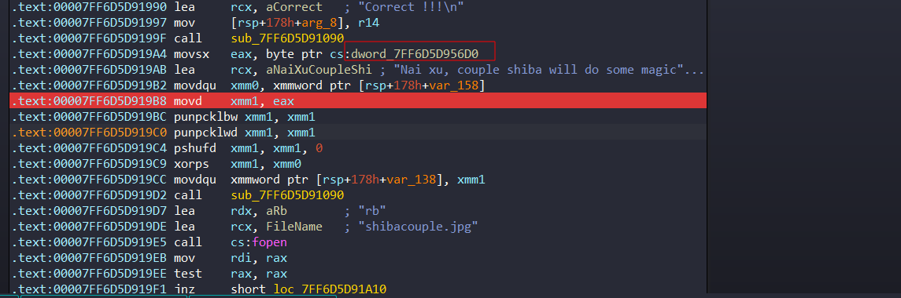

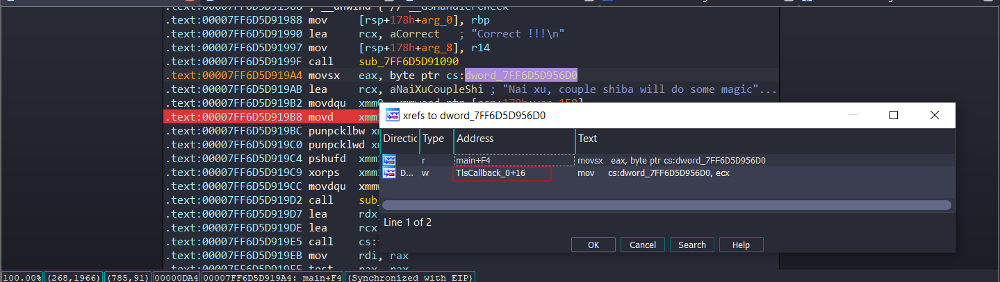

`TLSCallBack` được gọi ngay khi thread được tạo nên có thể nói nó còn được chạy trước cả hàm main. Ở đây ta thấy tại `TLSCallBack` là một đoạn code cũng check anti-debug bằng struct PEB. Nếu phát hiện chương trình không bị debug nó sẽ gán `dword_7FF6D5D956D0` với giá trị là 0x31 và ngược lại.

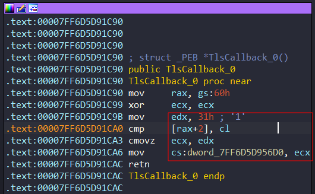

Vậy thực chất key của chúng ta khi nhập vào, đúng thì nó sẽ phải xor với 0x31 một lần mới trở thành key đúng cần để mã hóa. Vậy ta có mảng key đúng như sau dưới dạng hex: 6e 51 c0 87 5d da 48 d0 d3 d0 e3 55 dd 7f 16 e3.

Giải mã file ảnh bị encrypt với key trên ta được nửa đầu của flag.

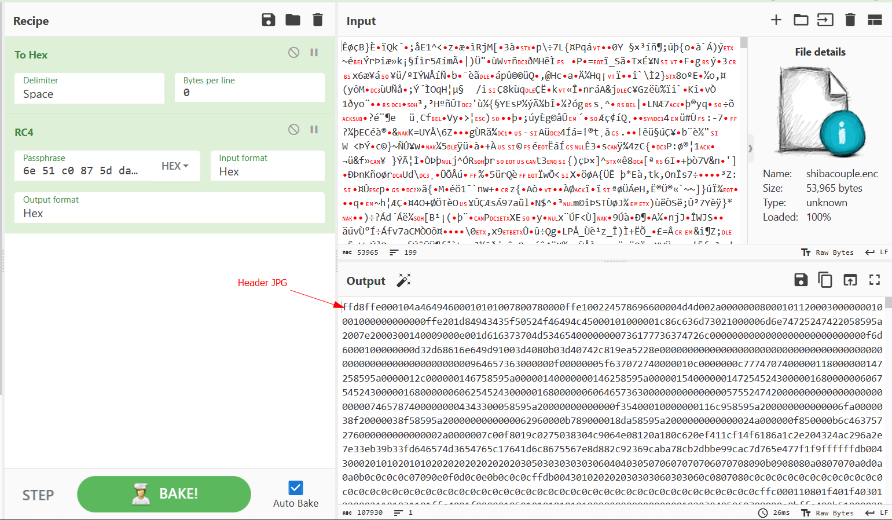

Ta vẫn còn nửa flag còn lại, có hai hướng để tiếp cận phần này.

1. Từ hàm `sub_140001000` bên cạnh việc dẫn đến hàm `sub_140001310`, trace các hàm được gọi nó còn dẫn đến 1 hàm nữa `sub_7FF6D5D91490` vừa vào là đã thấy nó copy một số ký tự lạ.
2. Xem strings để ý thấy có `USERPROFILE`, đây là biến được sử dụng để lấy thư mục home của user trên máy của hệ điều hành windows. Chuỗi này cũng được tham chiếu tới hàm `sub_7FF6D5D91490`.

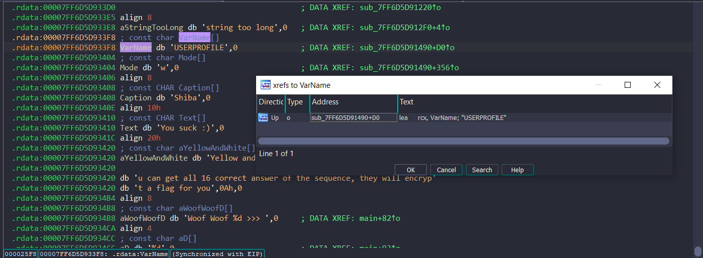

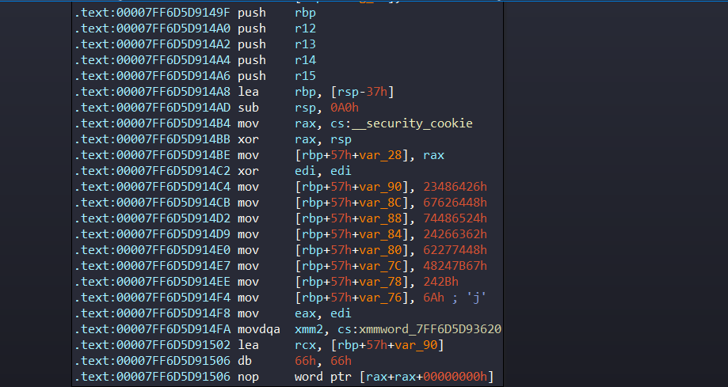

Nếu debug kiểm tra thử thì dễ dàng nhận thấy được đoạn code này được chạy sau khi hàm main kết thúc. Nó thực hiện xor giải mã đoạn flag sau với 0x17 và giải mã tên file xor với 0x7 rồi ghi file tại thư mục `USERPROFILE`.

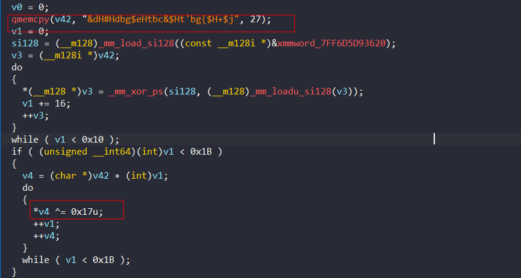

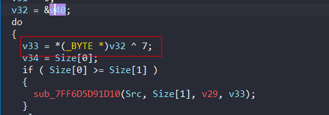

Nếu được chạy đúng, sẽ có một file `pwned.txt` được tạo ra.

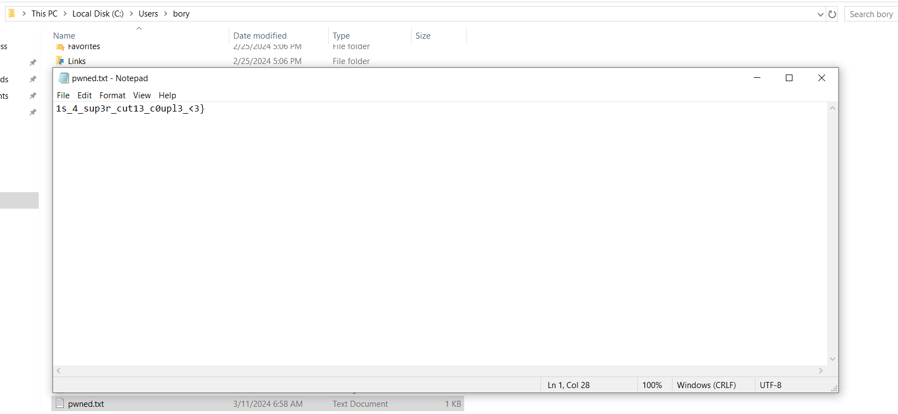

### **Vậy tóm tắt lại flow chương trình chạy như sau:**
- Vào `TLSCallBack`, check anti debug bằng struct PEB làm thay đổi giá trị `dword_7FF6D5D956D0`, gây sai lệch key khi decrypt RC4.
- Vào hàm `sub_140001310` check anti debug bằng `NtGlobalFlag`, giải mã đoạn chuỗi lệnh shutdown máy rồi thực thi nó. Nếu không phát hiện anti-debug thì `srand` với 0x1709.
- vào hàm main thực hiện mã hóa `RC4` với key là chuỗi số ngẫu nhiên với `srand` trên sau khi xor với `dword_7FF6D5D956D0`.
- Sau khi kết thúc hàm main, vào hàm `sub_7FF6D5D91490` giải mã nửa flag còn lại và ghi ra file `pwned.txt` vào folder `USERPROFILE`.

## Bonus

Ở challenge này tác giả muốn chia sẽ một số kỹ thuật sau để người chơi có thể lưu ý khi dịch ngược:
- [Anti debug cơ bản](https://anti-debug.checkpoint.com/techniques/debug-flags.html)
- Cách chạy code bên ngoài hàm main, trước khi main bắt đầu và sau khi main kết thúc: [Constructor/Destructor in C](https://stackoverflow.com/questions/36617689/how-to-invoke-a-c-function-after-main-finishes).
- 1 cách khác chạy code trước khi hàm main bắt đầu, ngay khi thread vừa được tạo. [TLSCallBack](https://unprotect.it/technique/tls-callback/).
- Đặc điểm nhận diện thuật toán mã hóa RC4 là có 2 vòng for chạy tạo key trong đó vòng đầu tiên chạy từ 0-255 và vòng for thực hiện mã hóa.

**END!!!**