# NobiZ

## Description

Doraemon là một bầu trời tuổi thơ của tôi :D

  **Lưu ý:** Đây là game kinh dị, không dành cho các bạn yếu tim 😎

[Release](https://github.com/FIA-FPT-Information-Assurance-Club/2024-Technical-Entrance-Test/tree/main/reverse/NobiZ/dist)

Source file dùng để mã hóa flag
[Source](https://github.com/FIA-FPT-Information-Assurance-Club/2024-Technical-Entrance-Test/tree/main/reverse/NobiZ/source/encryption.cpp)

### Objective

- Dịch ngược đọc hiểu code C về thao tác trên file.
- Hiểu cách sử dụng thư viện có sẵn của Windows

### Difficulty

`medium`

### Flag

`FIA{R3_1s_fun_1snt_1t73}`

## Challenge

Đầu tiên mới nhận một con game về thì chúng ta sẽ thử chơi game, đúng chứ?
Khi mà không biết điều khiển thì chúng ta sẽ đọc hướng dẫn(Bấm Esc>Bảo bối)
Phần lớn flag sẽ rải rác trong 2 quyển hướng dẫn:

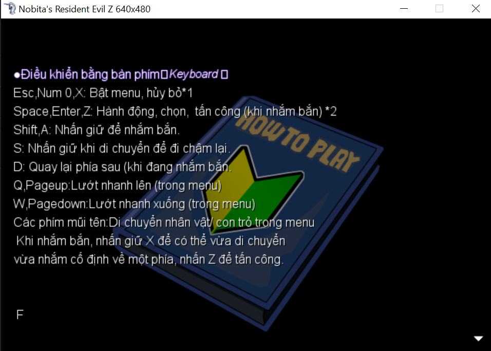

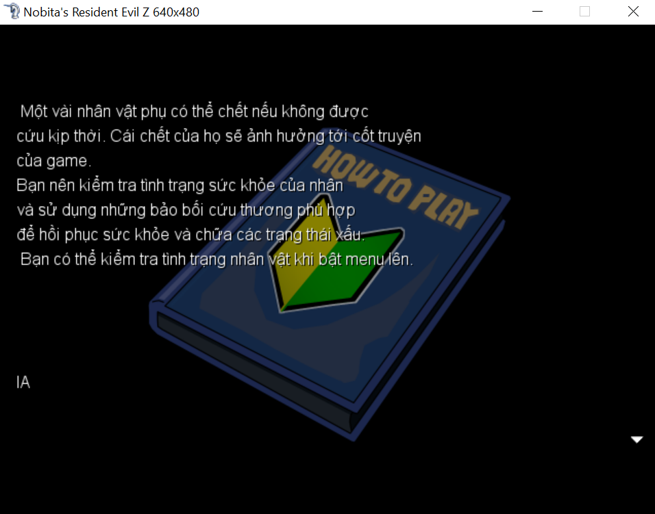

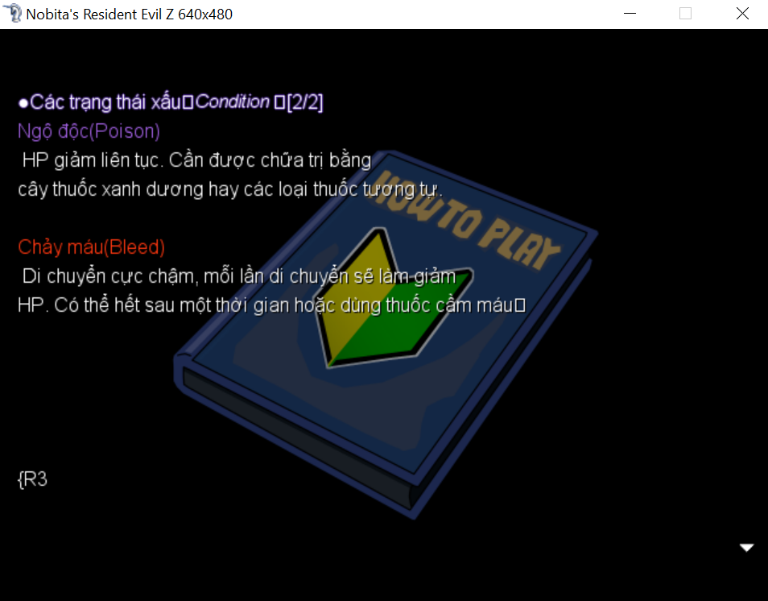

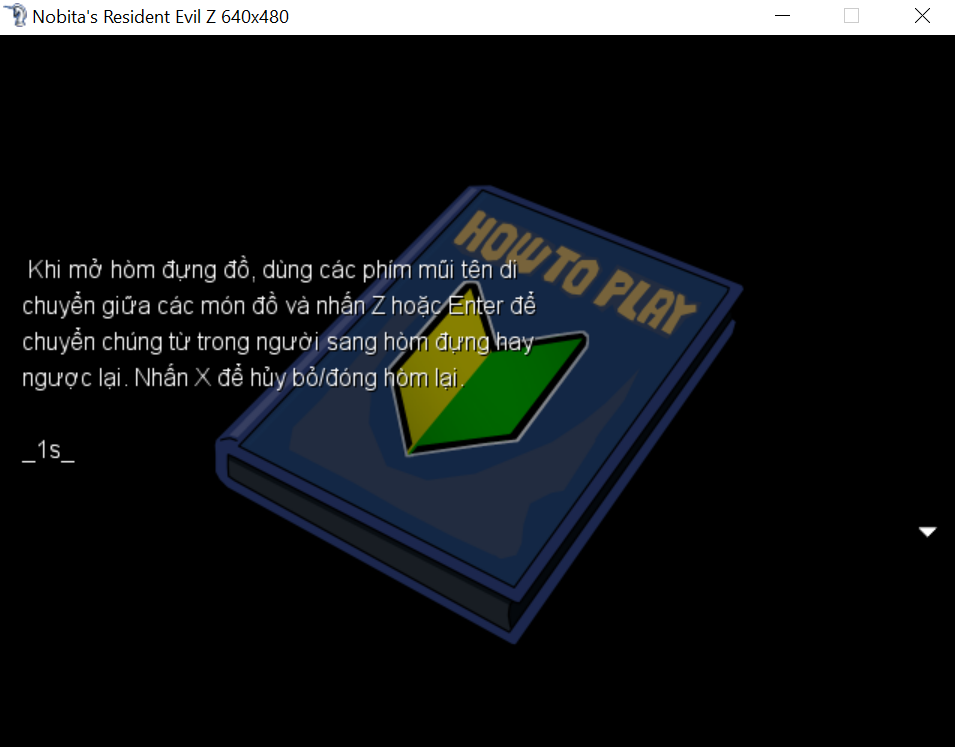

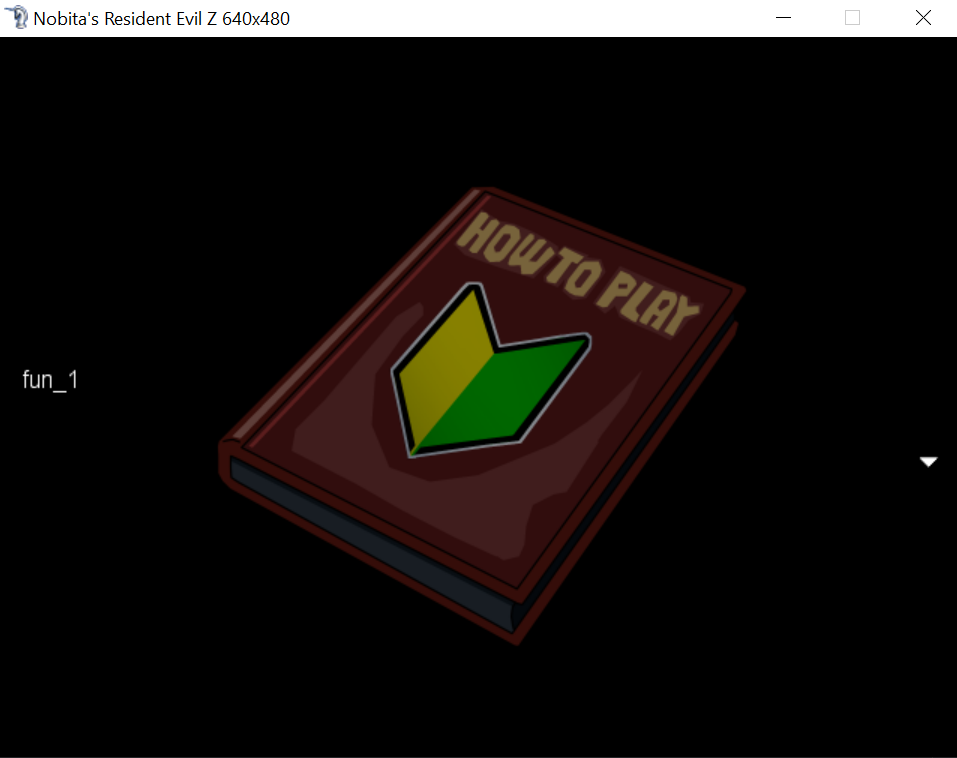

Sau khi chơi game chán chê rồi cũng không tìm thấy manh mối nào thì ta sẽ tiến hành giải nén game.
Để ý thấy file `Game.rgss2a` trông có đuôi rất lạ, chúng ta thử lên google tra thì biết là "Kho lưu trữ mã hóa RPG Maker VX RGSS chứa các tệp được mã hóa được tạo bằng cách sử dụng chương trình có tên RPG Maker VX"
Để giải file này chúng ta dùng [Link](https://wiki.rpgmaker.es/ayuda/utilidades/rpg-maker-xp-vx-vx-ace-decrypter)

Sau khi extract ta thấy có 2 file ở Graphics `flag.png` và `encrypted.txt`.
Mở file `flag.png` không được ta liền dùng DIE thì thấy nó là file PE 64-bit.

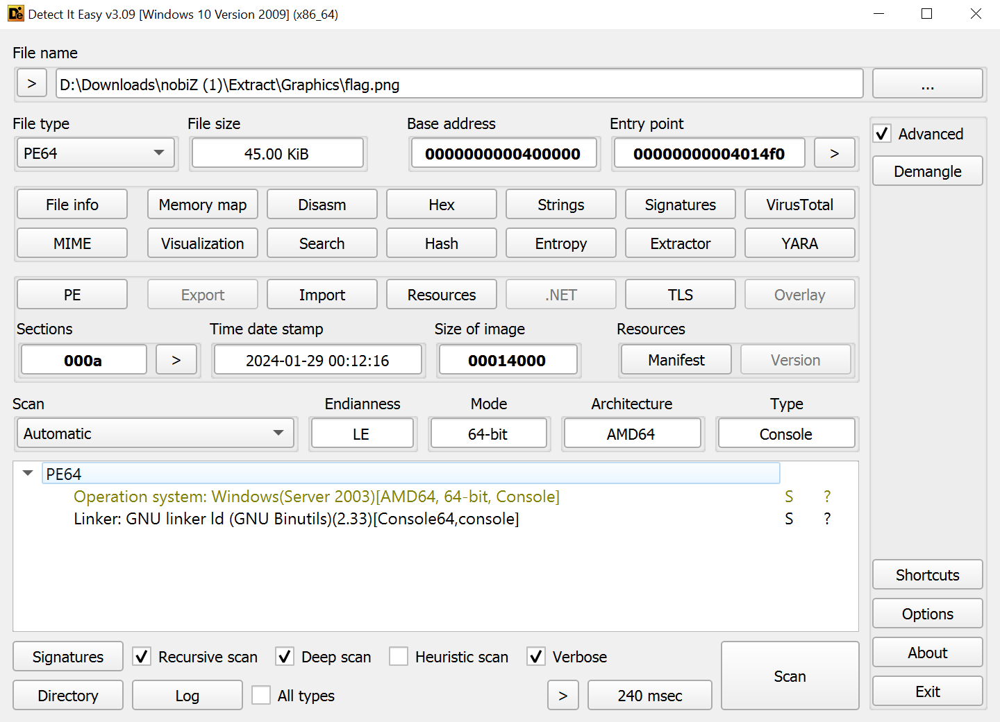

Liền quăng vào IDA, có khá nhiều hàm, ta Shift+F12 để mở vọc Strings của chương trình

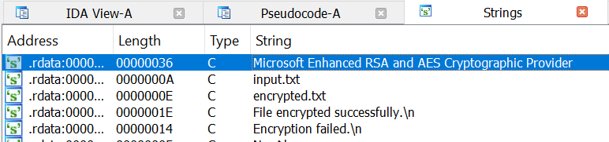

Bấm vào và Xref to của mấy strings thì biết 2 hàm chính cần quan tâm ở đây `sub_401848` gọi là hàm main và `sub_401560` gọi là hàm encrypt

Để ý ở hàm main `v1` được chép từ `unk_40A080` bấm vào ta thấy nó rất dài, đây chính là key

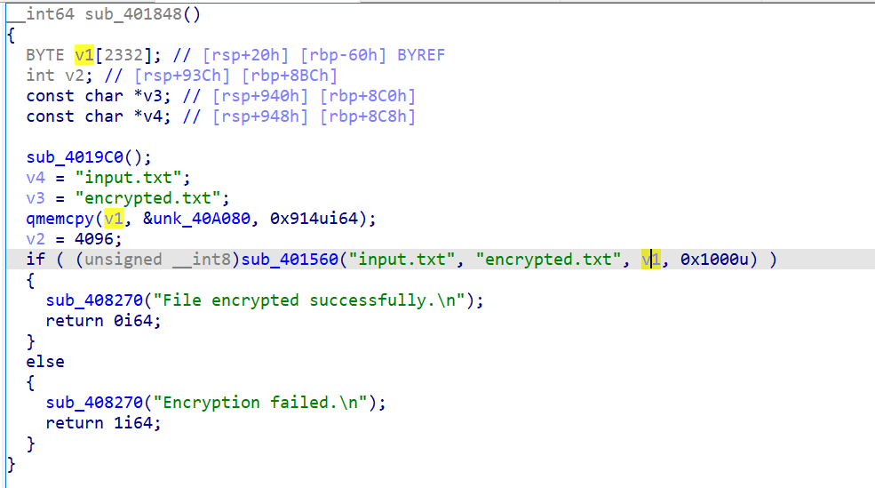

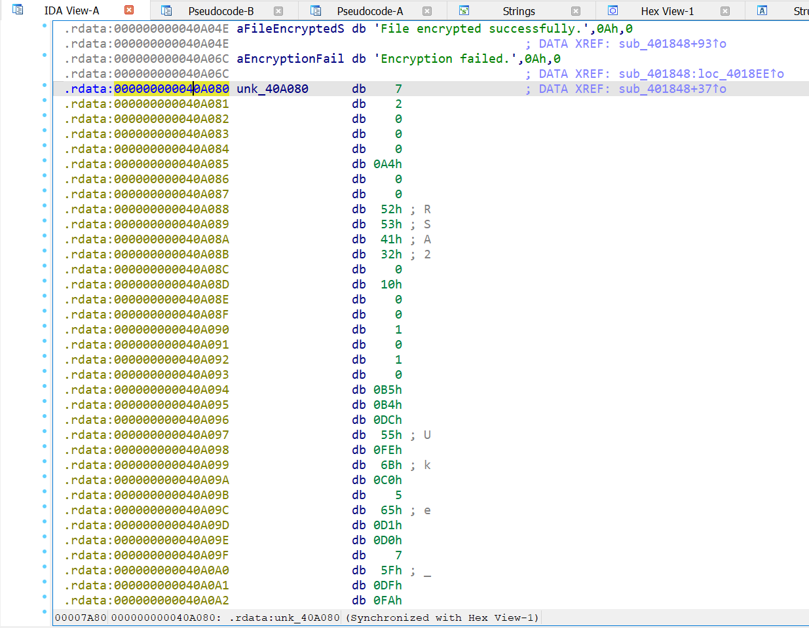

Quay lại hàm encrypt, ta F5 để lấy pseudocode của nó

Từ đây ta hiểu sơ bộ cách chương trình chạy:
- Load key vào `v1`, nhận giá trị input.txt và encrypted.txt và 0x1000 vào hàm `sub_401560`
- Thiết lập bộ mã hóa bằng CryptAcquireContextA
- Nhận key bằng CryptImportKey
- Mở File để đọc và ghi
- Mã hóa File bằng CryptEncrypt
- Đóng File kết thúc chương trình

Khá đơn giản phải không nào?

## Solve

Có 2 cách cho chúng ta giải:
- 1 Là viết scirpt chép y chang lại chương trình, thay CryptEncrypt thành CryptDecrypt, dùng chatGPT để hỗ trợ rồi thay key vào
- Nhưng cách trên khá tốn thời gian vì key rất dài nên mình sẽ chỉ mẹo đơn giản hơn

Sau đây sẽ là hướng dẫn cách 2
+ Đầu tiên thay file encypted.txt thành input.txt
+ Quăng chương trình vào x64dbg, rồi đặt break point lúc CryptEncrypt chuẩn bị thực hiện, rồi chạy tới đó

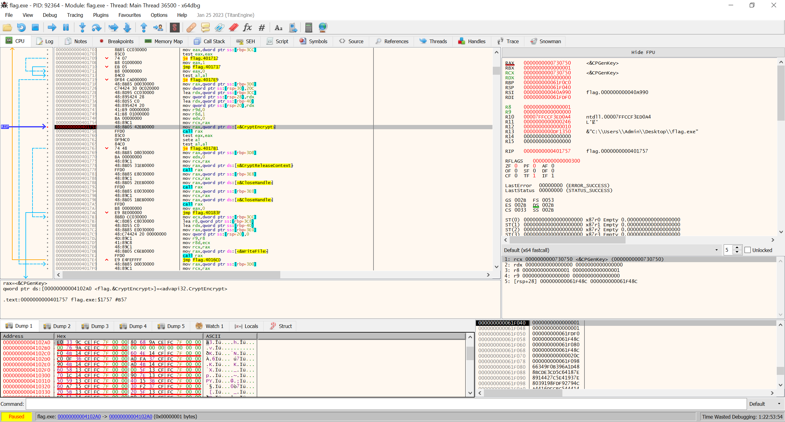

+ Chuột phải vào chỗ CryptEncrypt bấm Follow in Dump > Constant: 00000000004102A0 <flag.CryptEncrypt>

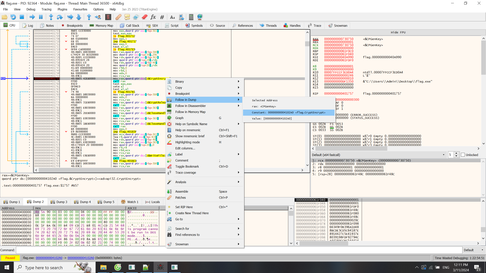

+ Ở dưới phần Dump tại byte đầu của địa chỉ `4102A0` thay `E0` thành `60`

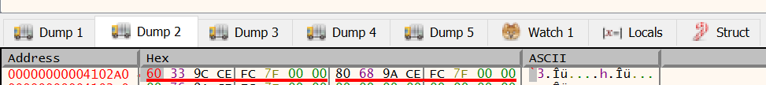

+ Rồi chạy hết chương trình
+ Tada kết quả là encrypted.txt sẽ có phần còn lại của flag

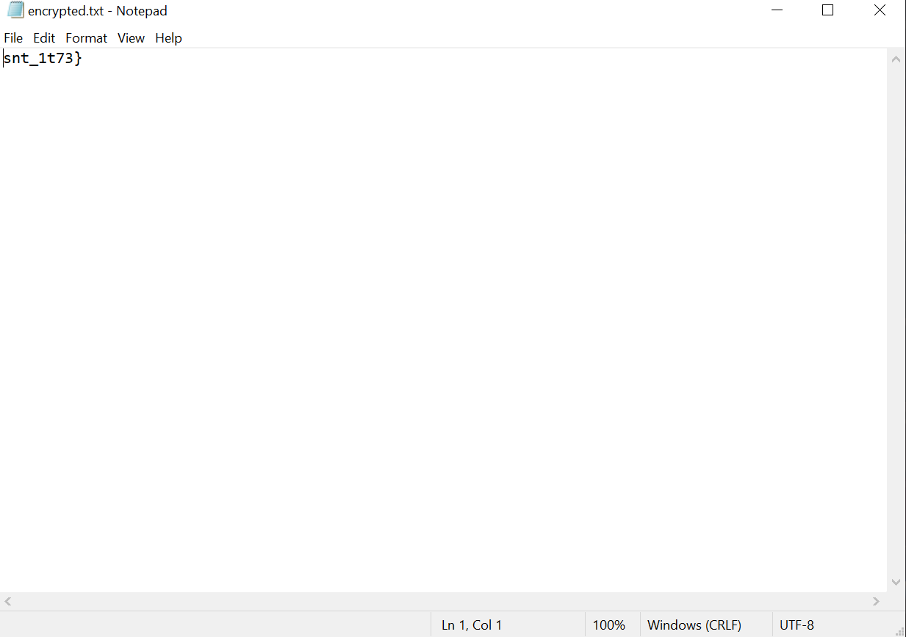

Lý do vì sao có thể đổi được mà chương trình chạy được là CryptEncrypt và CryptDecrypt có tham số gần giống nhau.
Có thể xem trên trang của Windows để biết thêm
Còn vì sao biết mà đổi `E0` thành `60` thì

Chuột phải vào chỗ CryptEncrypt > Follow in Disassembler > Value: [00000000004102A0]

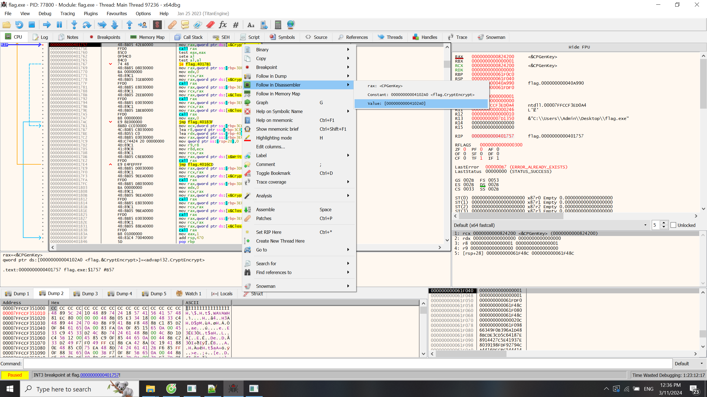

Sẽ dẫn ta tới jump table của thư viện `advapi32.dll`
Kéo lên chút thì Address của CryptEncrypt và CryptDecrypt là 00007FFCCE9C33E0 và 00007FFCCE9C3360
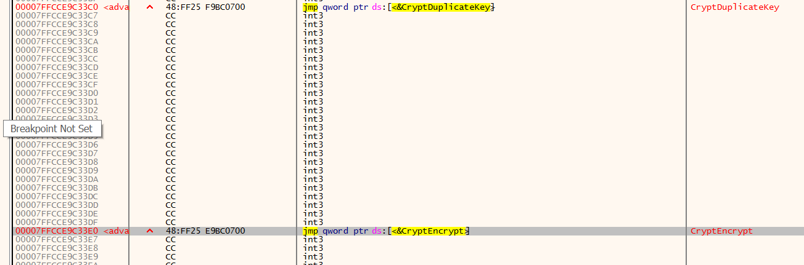
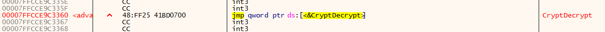

Sau đây là script cho cách 1
[Script here !!!](https://github.com/FIA-FPT-Information-Assurance-Club/2024-Technical-Entrance-Test/tree/main/reverse/NobiZ/source/decryption.cpp)