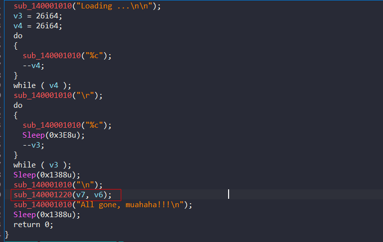

# Shiba Baby

## Description

Vào đêm giáng sinh năm 2023, gia đình nhà Shiba gồm White Shiba, Yellow Shiba và Shiba Puppy đi chơi đá tuyết với nhau. Sau chuyến đi chơi gia đình đã chụp được rất nhiều bức ảnh xinh xắn.

 Tuy nhiên do mãi ham chơi Shiba Puppy đã vọc vạch phải một chương trình kỳ lạ khiến tấm ảnh của anh ta bay màu. Bạn hãy giúp cậu bé khôi phục lại tấm ảnh của mình nhé.

[Release](https://github.com/FIA-FPT-Information-Assurance-Club/2024-Technical-Entrance-Test/tree/main/reverse/Shiba-Baby/dist)

[Source](https://github.com/FIA-FPT-Information-Assurance-Club/2024-Technical-Entrance-Test/blob/main/reverse/Shiba-Baby/source/flagdayne(c2hvcnR1cmwuYXQvb0RJTFI%3D).cpp)

### Objective

- Dịch ngược đọc hiểu code C về thao tác trên file.
- Hiểu được hàm random sử dụng trên các ngôn ngữ khác nhau, trên các arch khác nhau sẽ hoạt động khác nhau.

### Difficulty

`medium`

### Flag

`FIA{twinkle_twinkle_little_shiba}`

## Challenge

Đây là một file PE 64-bit C/C++ nên mình laod vào IDA. Mới vào đã có rickroll :D

Ban đầu chương trình in ra banner của chương trình, coi như không quan tâm vì nó chỉ thực hiện nhìn cho đẹp thôi. Vấn đề sẽ nằm ở hàm `sub_140001220` trong hình.

Hàm `sub_140001220` nhận vào hai tham số lần lượt là đường dẫn file `shibapuppy` và `shibapuppy.encrypted` nên có thể hiểu nó thực hiện mã hóa ở đây.

Tiến hành phân tích hàm mã hóa ta có thể rút ra lần lươt những phân tích sau đây:
- Chương trình chia file thành ba đoạn để mã hóa dựa trên độ lớn file `v6/3`.
- Dùng hàm `fseek` và `ftell` để tính toán độ lớn của file lưu vào `v6`.
- Phần đầu tiên dùng độ lớn của file làm seed với `srand`, rồi mã hóa xor từng byte với từng số được sinh ra từ hàm `rand`.

- Phần thứ hai tiếp tục mã hóa bằng xor với 4 byte magic number của file.

- Đối với phần thứ ba dùng thời gian tại thời điểm thực thi file làm seed cho hàm random. Seed sau khi sinh ra được lưu trong biến `v12`, tách ra 2 byte đầu (MSB - Most significant bit) lưu trong `v16` và 2 byte sau (LSB - Least significant bit) lưu trong `v17`.
- `v16` được viết vào file ngay sau đoạn mã hóa thứ hai, còn `v17` được viết vào cuối file.
- Phần thứ ba vẫn được mã hóa từng byte với từng số được sinh ra từ hàm `rand`.

## Solver

Vậy ta sẽ thực hiện giải mã theo các bước như sau:
- Đọc file và tính độ lớn file rồi trừ đi cho 4 (do có 4 byte thời gian được ghi thêm vào file mã hóa).
- Dùng độ lớn làm seed, dùng hàm `rand` lấy ra chuỗi số ngẫu nhiên để giải mã xor 1/3 file đầu tiên.
- Đọc 4 byte magic number đúng sau khi giải mã phần đầu và đem chúng đi giải mã xor với phần thứ 2
- Ngay sau khi giải mã phần thứ 2, đọc 2 byte (MSB của seed) ghép với 2 byte cuối file (LSB của seed) là ta có thể khôi phục lại seed thời gian.
- Dùng seed vừa khôi phục được để giải mã ra phần cuối của file bị mã hóa.

**Lưu ý:** Đối với hàm random của mỗi ngôn ngữ sẽ sử dụng một bộ [`PRNG`](https://stackoverflow.com/questions/47114939/python-randomint-should-be-equal-to-c-rand) khác nhau nên kết quả của chuỗi số ngẫu nhiên sẽ khác nhau. Vì thế nên để giải được bài này, cần phải viết code giải bằng ngôn ngữ C.

[Script here !!!](https://github.com/FIA-FPT-Information-Assurance-Club/2024-Technical-Entrance-Test/tree/main/reverse/Shiba-Baby/source/Solve)

