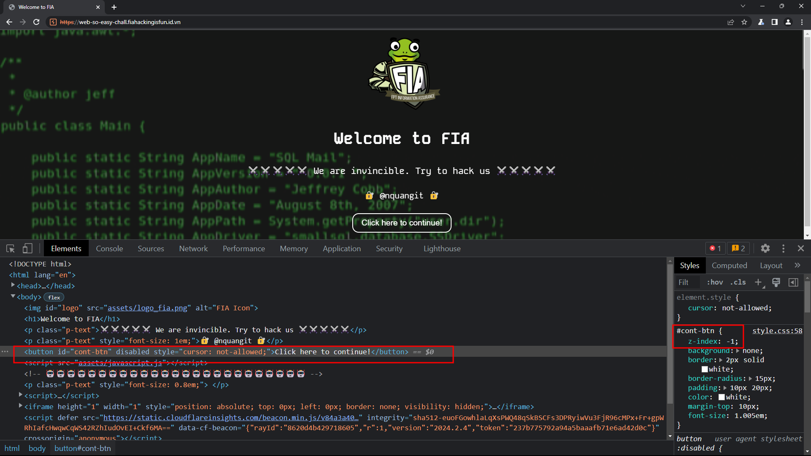
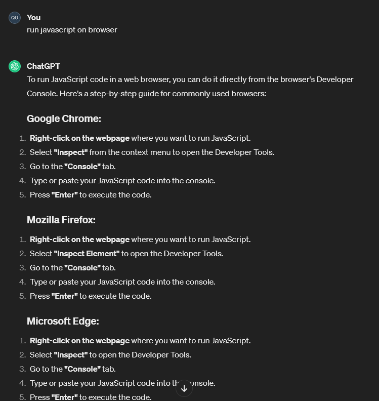

# Web Exploitation: Ez-Web-PHP
`
Description: We have PHP, robots, and ourselves, we can go to every corner of the world and find the hidden flag. This trip is starting at a fast pace with restrictions, can you overcome the restrictions and slow down this trip?
`

Challenge: [Link](https://web-so-easy-chall.fiahackingisfun.id.vn/)

## Skill required:
- Basic Web Exploitation
- Basic HTTP Request


### Overview 


# Table of contents
1. [Analyzing](#analyzing)
2. [Solving](#solving)
    1. [Find the way to click the button](#click-button)
    2. [Look for robots.txt file](#robots)
    3. [Final part](#final)
3. [Flag](#flag)


### 1. Analyzing <a name="analyzing"></a>
- We have a website with button "Click here to continue!" but we can't click it.
- Reading the description, we can see that the challenge is about PHP and robots. So, we can assume that there is something related to **robots** - `robots.txt` file.

### 2. Solving <a name="solving"></a>
#### 2.1. Find the way to click the button.<a name="click-button"></a>
- Inspect the button, we can see that it's have an CSS property **`z-index: -1`**. So, we can't interact with it. Try to disable it and click the button.



- But it doesn't work, when we hover the button, we can see that the cursor is disabled. So, we also can't click it.
- It seems a little bit hard for newbies, but we can use JavaScript to simulate a click event. *(We also have a hint: "Click a button without touching it, it's magic from the ECMAScript.")*
- Try to ask ChatGPT for help, we can get the JavaScript code to simulate a click event.

```javascript
document.getElementById('button-id').click()
```


- Now, we have the button id is `cont-btn`. Let's try to simulate a click event.

```javascript
document.getElementById('cont-btn').click()
```

- We can run that JavaScript code directly in the browser - through DevTools.




- After the click, we can see some redirect. But it's too fast, so we use BurpSuite to intercept the request and see the response.
- We can use the `HTTP history` tab to see the request and response.


- Or use the `Intercept` tab to intercept the request and see the response.


- We have the flag is `RklBezF0XzE1X3Mw`
- Decode it with base64, we have a part of flag is **`FIA{1t_15_s0`**.

- May be we have done with the button, so go to the next step.

#### 2.2. Look for `robots.txt` file <a name="robots"></a>
- Try to access `robots.txt` file, we can see that it's have a disallow rule for `/s3cr3t_f0ld3r/`.


- Access to `/s3cr3t_f0ld3r/`, we can see a 404 page.


- What the f*ck is happening? Is the server have a problem? No, it's not. It's a challenge, so we need to find the flag.
- Try to check the network tab in DevTools, we can see that the server response with a 404 page, but the status code is 500 (Internal Server Error). SUSPICIOUS!


- Look at the line number in the source code, we can realize that still have content below the `</html>` tag. It's a comment, so we can't see it in the browser.
- Additionally, there is a JavaScript file named `cloudflare-js-***.js` stored in the `s3cr3t_f0ld3r`. SUSPICIOUS!


- Check the hidden content in the comment


- We have the pass code is `nquangit`. The hint said that we need to find a form or text input, but in the source code, wa can't see any form or text input.
- Combining this hint with the SUSPICIOUS JavaScript file, we can assume that it has a hidden form or text input that was appended to the DOM by the JavaScript file.
- So, we try to find the JavaScript file and check it. But it was obfuscated, try to deobfuscate it -> and it doesn't work :))
- WHAT THE H*LL IS HAPPENING? IT"S SO HARD FOR NEWBIES! Noooooo.
- It's easy, but we look at the wrong place. Try Inspect the page. It have a hidden form inside the `address` tag.


- Enter the pass code `nquangit` and `Enter`

- After going through a few redirects we have.


- The redirect is also too fast, so we use BurpSuite to intercept the request and see the response.


- And we have the flag is `XzNANXlfVDBfMHYzcmMwbTNf`
- Decode it with base64, we have a part of flag is **`_3@5y_T0_0v3rc0m3_`**.

#### Final part <a name="final"></a>
`⚠️ Final part: you must send a post request to /get_f1nal_fl4g.php. Data: "hacker=me" ⚠️`

- I think it's an easy part, ask Google or ChatGPT for help. We can find a lot of ways to send a POST request. But I will use `curl` command.

```bash
curl -X POST https://web-so-easy-chall.fiahackingisfun.id.vn/get_f1nal_fl4g.php -d "hacker=me"
```


- We have the final part `dGgxc19jaDRsbDNuZzN9` and decode it with base64, we have a part of flag is **`th1s_ch4ll3ng3}`**.

### Flag <a name="flag"></a>
- Concatenate all the parts of the flag, we have the flag is
**`FIA{1t_15_s0_3@5y_T0_0v3rc0m3_th1s_ch4ll3ng3}`**